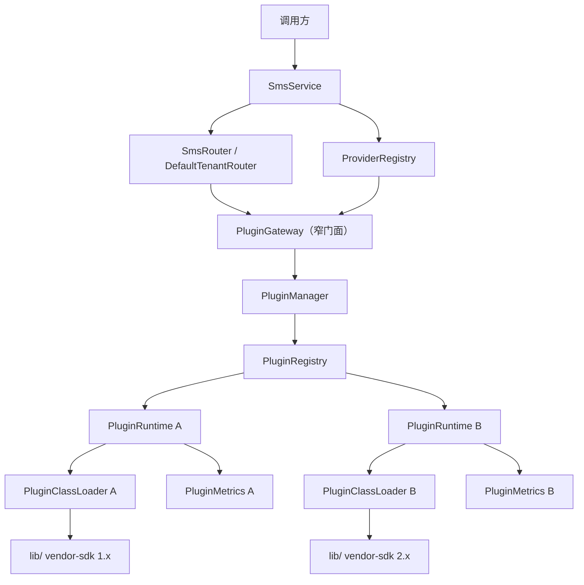
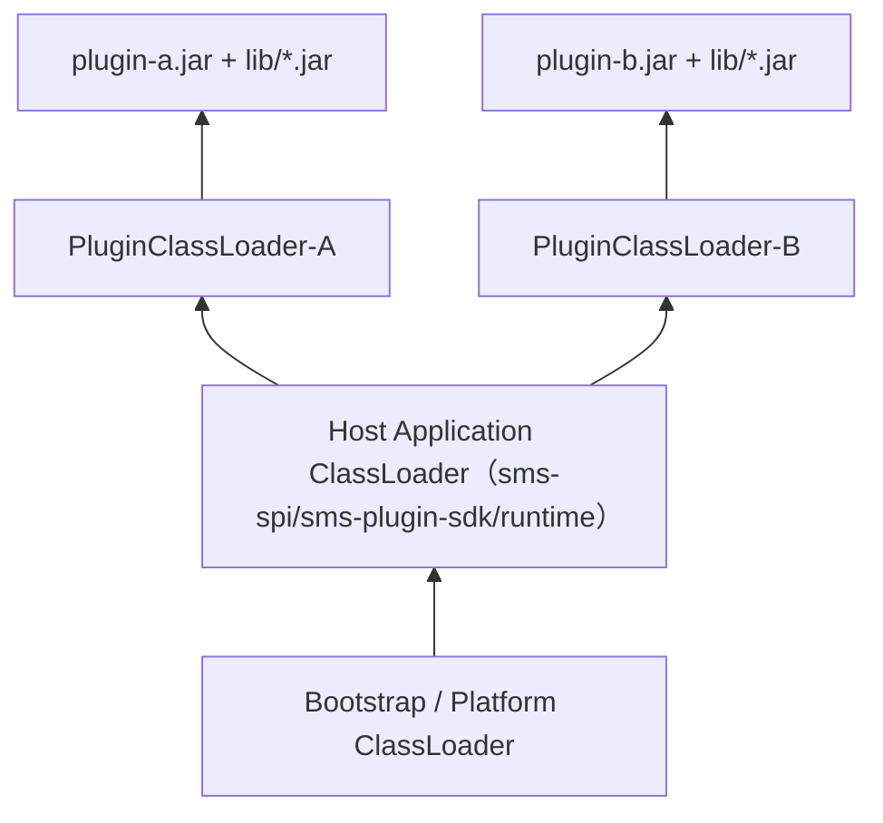
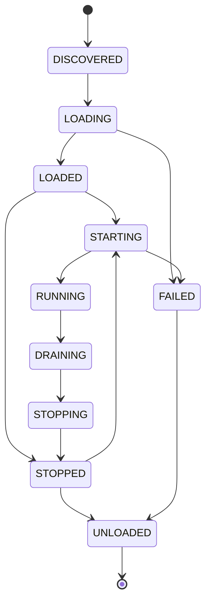
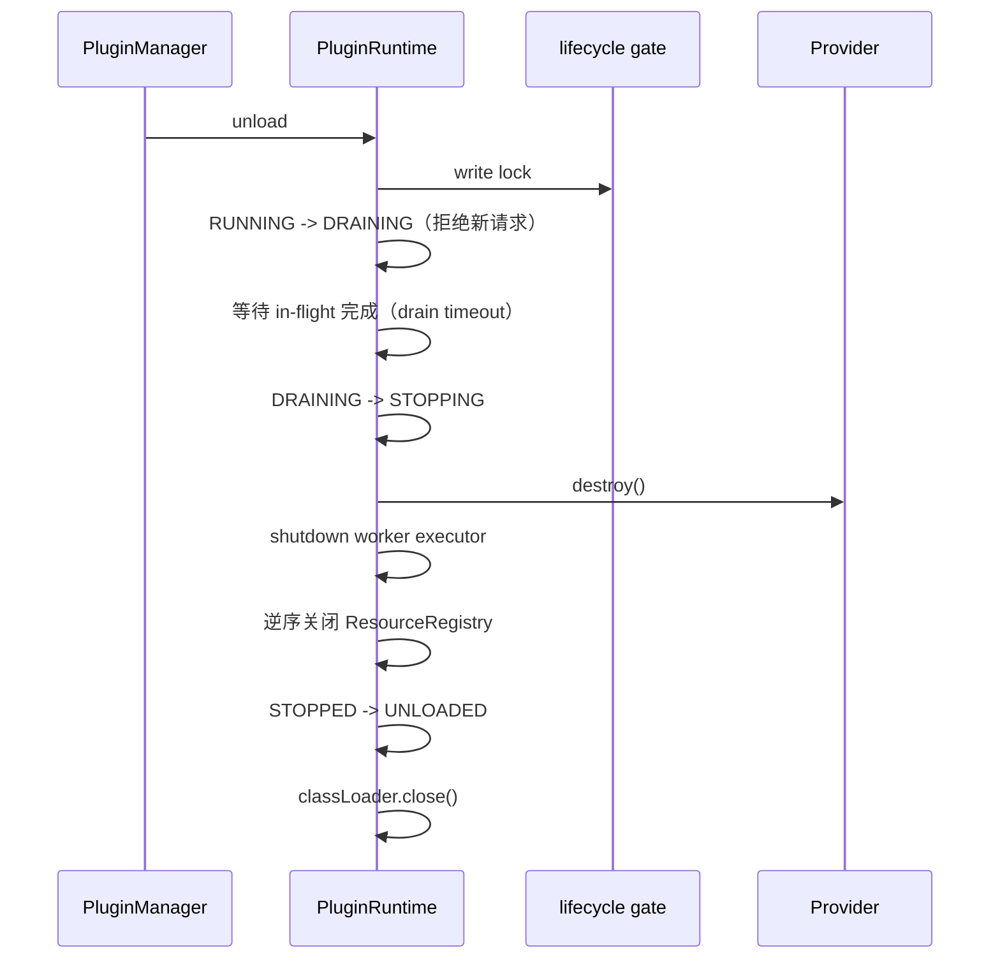
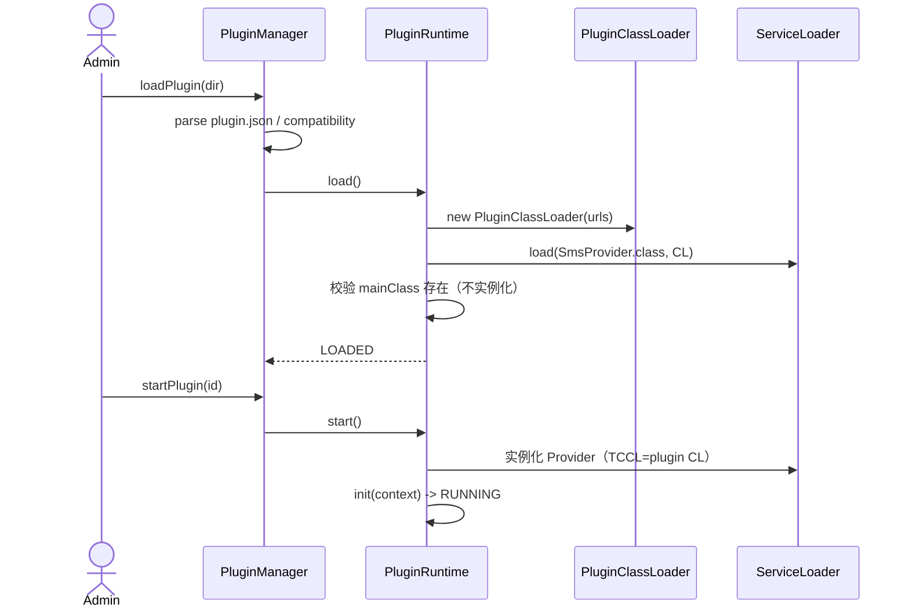
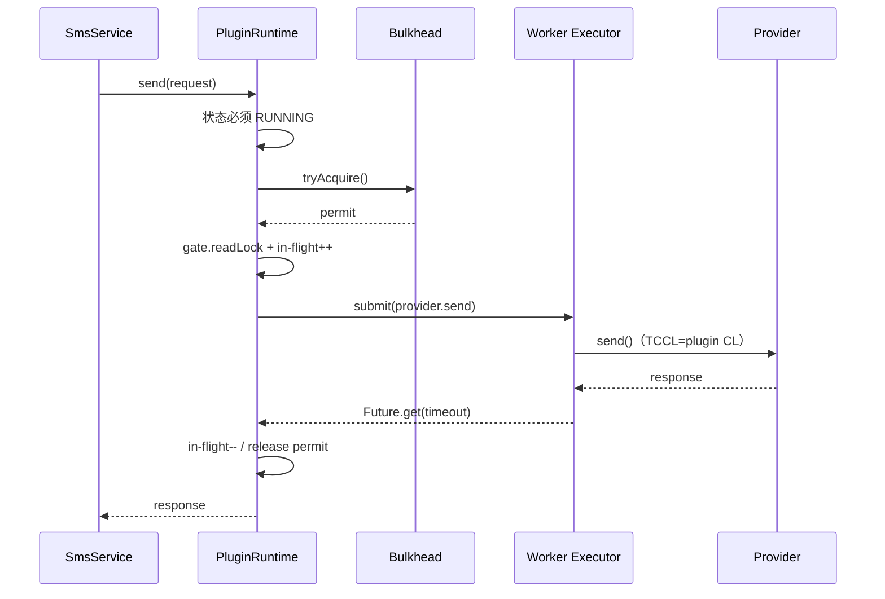
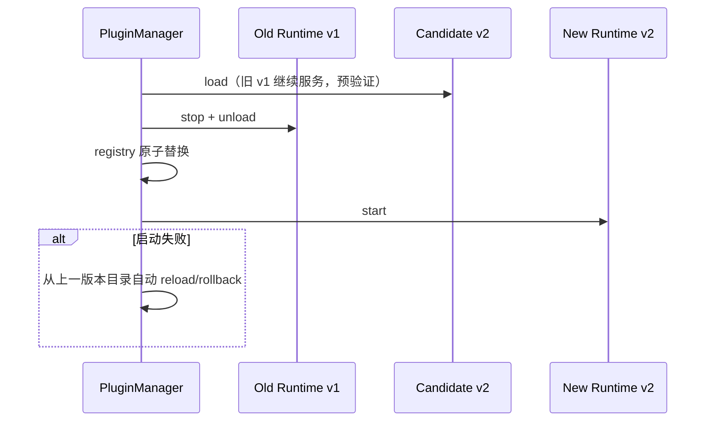
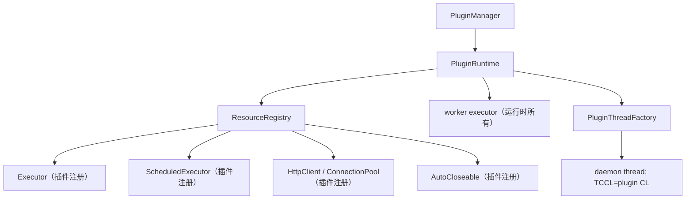
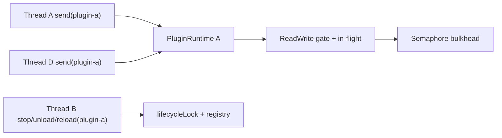

# SMS Plugin Runtime（classloader-sms）

一套不依赖 Spring/OSGi/PF4J 的**生产级 SMS SPI 插件运行时**，全部基于 JDK 17
原生能力（`URLClassLoader`、`ServiceLoader`、并发工具、`java.util.logging`、
`WeakReference`/`ReferenceQueue`）实现。

核心目标：

```text
稳定 SPI + 插件 ClassLoader 隔离 + 第三方依赖版本隔离
+ 运行时动态加载/卸载/Reload + 升级/回滚
+ ClassLoader 可回收 + 资源可销毁 + 线程可治理
+ 并发安全 + 优雅停机 + 故障隔离 + 可观测/可诊断
+ JUnit 5 自动化测试 + 可运行 Demo
```

---

## 一、模块划分（相对 `classloader-sms/`）

```text
classloader-sms/
├── pom.xml                    # aggregator（Java 17 release）
├── sms-spi/                   # 宿主加载的稳定 SPI 契约，零依赖
├── sms-plugin-sdk/            # 插件开发辅助（AbstractSmsProvider），只依赖 SPI
├── sms-plugin-runtime/        # 宿主内部实现：ClassLoader/生命周期/资源/线程/metrics
├── sms-service/               # 业务路由/ProviderRegistry/SmsService
├── sms-test-plugins/          # 测试插件与“第三方”依赖
│   ├── sms-test-dependency-v1 # 同 FQCN 的 vendor dependency v1
│   ├── sms-test-dependency-v2 # 同 FQCN 的 vendor dependency v2
│   └── sms-plugin-parent/     # plugin-a/b/conflict/slow/threads/resources + broken 系列
├── sms-tests/                 # JUnit 5 集成/隔离/并发/泄漏/GC 测试
└── sms-demo/                  # 可运行 main()
```

架构上刻意保持三层隔离：

```text
sms-spi              稳定契约（只出现一次，只由宿主加载）
    ↓
sms-plugin-sdk       插件开发辅助（宿主 parent-first 提供）
    ↓
sms-plugin-runtime   宿主内部实现（插件永远不可见）
```

插件源码只依赖 `sms-spi` 与 `sms-plugin-sdk`。`sms-plugin-runtime` 与
`SmsRouter/SmsService` 之间只通过窄接口 `PluginGateway` 通信。

---

## 二、总体架构



`PluginManager` 只负责 registry 与生命周期编排；每个 `PluginRuntime` 独立拥有：

- `PluginClassLoader`
- `PluginState` 状态机
- bulkhead（`Semaphore`）
- in-flight 计数器与 drain 门闸
- 限界 worker executor
- `PluginResourceRegistry`
- `PluginMetrics`
- `PluginConfigView`
- provider 实例

---

## 三、ClassLoader 模型



委派规则（`PluginClassLoader`）：

| 类型 | 策略 | 原因 |
| --- | --- | --- |
| `java.* javax.* jdk.* sun.*` | parent-first | 不允许覆盖 JDK |
| `com.hsin.sms.spi.*` | parent-first（严格） | SPI 类只存在一份，杜绝 `ClassCastException` |
| `com.hsin.sms.sdk.*` | parent-first | 插件 SDK 由宿主稳定提供 |
| 插件自身代码、`lib/*.jar` 的第三方依赖 | child-first | A/B 可同时使用不同依赖版本 |

`SmsProvider`、`SmsRequest`、`SmsResponse` 等只能由宿主侧加载。插件 jar
即使误打包了同名 SPI 类，类加载器也会命中宿主副本而不是静默加载第二份。

---

## 四、生命周期与状态机



非法跳转（例如 `RUNNING → UNLOADED`）会被 `PluginState` 拒绝并抛出
`PluginStateException`。卸载必须经过 drain：



主要时序：







---

## 五、Resource / Thread Ownership



责任规则：

- Executor/Thread 由谁创建：运行时 worker 由 `PluginRuntime` 创建；插件自建资源
  一律通过 `SmsProviderContext.newExecutor/newScheduledExecutor/newThreadFactory`
  创建并登记。
- 谁关闭：worker 由 `stop()` 关闭；插件登记资源由 `PluginResourceRegistry`
  逆序关闭；关闭幂等。
- 失败怎么办：单资源关闭失败记录到 metrics 与日志，不阻断其余资源关闭。
- TCCL：进入 provider 前设置插件 CL，`finally` 中恢复；worker 线程本身由
  `PluginThreadFactory` 固定 TCCL。

---

## 六、并发模型



- 发送路径：registry 无锁查找 → 状态检查 → bulkhead → read lock 内做“RUNNING +
  in-flight++” → 释放 read lock 后执行 provider。
- 停止路径：write lock 内置 DRAINING，之后新请求拒绝，等待 in-flight 完成。
- 生命周期操作由 `PluginManager` 的单锁串行；发送与生命周期互不长时间阻塞。
- 每个 runtime 的 `PluginState` 用 `volatile` + 受锁转换，无多线程随意改写。

---

## 七、SPI 设计

`sms-spi` 包 `com.hsin.sms.spi`：

- `SmsProvider`：`metadata()` / `capabilities()` / `init(ctx)` / `send(req)` /
  `destroy()`
- `SmsRequest`：requestId/businessId/idempotencyKey/phoneNumbers/content/templateId/
  templateParams/timeout/extensions，全部稳定 Java 类型、不可变、明确 null 与校验策略
- `SmsResponse` / `SmsError` / `SmsResult`：服务层结果与厂商错误分类
- `SmsProviderCapabilities` / `SmsCapability`：SEND_SMS/TEMPLATE_SMS/BATCH_SEND/
  QUERY_STATUS/INTERNATIONAL_SMS
- `SmsProviderContext`：只暴露 config/secret/受管资源/线程工厂；绝不暴露
  PluginManager/PluginClassLoader/插件运行时
- `PluginConfig`：字符串快照视图

幂等边界：runtime 不“自动去重”；`idempotencyKey` 随请求原样下传，由厂商能力与
宿主上层去重网关配合。不要把“响应丢失后客户端重试”的重复发送问题假想成 runtime
能自行解决。

---

## 八、plugin.json 与插件目录

```json
{
  "id": "aliyun-sms",
  "name": "aliyun-sms-provider",
  "version": "1.0.0",
  "vendor": "aliyun",
  "mainClass": "com.example.sms.aliyun.AliyunSmsProvider",
  "spiVersion": "1.0",
  "requiresJava": "17",
  "requiresSpi": ">=1.0 <2.0"
}
```

校验规则：

| 字段 | 必填 | 规则 |
| --- | --- | --- |
| id | 是 | `[A-Za-z0-9][A-Za-z0-9._-]*`；全局唯一 |
| name | 是 | 非空字符串 |
| version | 是 | 语义化版本格式 |
| vendor | 是 | 非空字符串 |
| mainClass | 是 | 必须出现在 `META-INF/services/...` 中 |
| spiVersion | 是 | `major.minor`；兼容策略见 `SpiCompatibilityChecker` |
| requiresJava | 否 | 默认 17，运行时必须 >= |
| requiresSpi | 否 | 例如 `>=1.2 <2.0` |

插件目录身份是 `pluginId`，不是目录名。生产建议使用 versioned/staging 目录：

```text
plugins/<plugin-id>/
├── current -> versions/1.1.0
└── versions/
    ├── 1.0.0/
    │   ├── plugin.json
    │   ├── plugin.jar
    │   ├── lib/*.jar
    │   └── config/application.properties
    └── 1.1.0/ ...
```

升级时先完整复制到新版本目录，再原子切换 `current`，避免半写状态。

### 完整性校验

- `FingerprintUtil` 提供 SHA-256 摘要。
- 扩展点 `PluginIntegrityPolicy` 默认 `ALWAYS_TRUST`。
- `Sha256IntegrityPolicy` 支持可选 sidecar：插件目录内放 `integrity.sha256`，
  每行 `<sha256-hex> <相对文件>`，load 前逐个校验；条目不得越出插件目录。
- 生产要求强制校验时，把 `manager.integrityPolicy(new Sha256IntegrityPolicy())`
  作为默认策略即可；真正的厂商签名可继续实现同一接口。

---

## 九、动态加载/卸载 API

```java
PluginManager manager = new PluginManager(PluginRuntimeSettings.defaults());
manager.loadPlugin(Path.of("plugins/vendor-a"));   // LOADED
manager.startPlugin("vendor-a");                    // RUNNING
manager.send("vendor-a", request);
manager.stopPlugin("vendor-a");                     // drain + stop
manager.unloadPlugin("vendor-a");                   // close CL + registry remove
manager.reloadPlugin("vendor-a");
manager.upgradePlugin("vendor-a", newDir);
manager.rollbackPlugin("vendor-a");
manager.close();                                    // 幂等 shutdown
```

完整可运行示例：`com.hsin.sms.demo.SmsDemo#main`。

---

## 十、测试覆盖（JUnit 5）

`sms-tests` 目前 19 个用例，覆盖：

- full lifecycle load/start/stop/restart/unload
- SPI Load / dynamic load & start
- ClassLoader 隔离：同 FQCN 的 `LibraryInfo` 在 plugin-a（v1）/plugin-b（v2）/
  plugin-conflict（v2）中为不同类，且各自行为正确
- ServiceLoader 使用插件 CL、SPI 由宿主加载
- Dependency version isolation / failure isolation
- descriptor validation / SPI compatibility
- scanner
- graceful drain、timeout、bulkhead
- thread/resource leak（unload 后无插件线程残留、注册资源全部关闭）
- class loader GC（WeakReference + ReferenceQueue + 多次 GC，最终一致观察）
- upgrade + rollback
- concurrent send + reload

运行：

```bash
export JAVA_HOME=$(/usr/libexec/java_home -v 17)
mvn -f classloader-sms/pom.xml clean package
# 或在仓库根目录构建整个 reactor：
mvn clean package

# 从仓库根目录运行 demo（需要先 package 生成插件目录）：
java -cp classloader-sms/sms-demo/target/classes:\
classloader-sms/sms-service/target/classes:\
classloader-sms/sms-plugin-runtime/target/classes:\
classloader-sms/sms-plugin-sdk/target/classes:\
classloader-sms/sms-spi/target/classes \
  com.hsin.sms.demo.SmsDemo
```

---

## 十一、Production Readiness

### 为什么可以用于生产

- 核心边界全部由 JDK 原生类型表达：`URLClassLoader`、`ServiceLoader`、
  `ConcurrentHashMap`、`Semaphore`、`ReentrantReadWriteLock`、daemon 线程工厂、
  显式资源注册、状态机守卫。
- 不把卸载实现成“close classloader”；每个卸载都先 drain、停线程、关资源、
  清 provider、清 ServiceLoader，再 close 并移出 registry。
- 插件异常被隔离到单个 runtime；注册表与路由层看不到失败 runtime。
- 有 metrics/诊断快照，能回答“某类由哪个 ClassLoader 加载”。

### JVM 限制（诚实声明）

1. Java 无法安全强制杀死任意阻塞中的插件线程。timeout 只能放弃等待并 interrupt；
   worker 是 daemon 且受 drain 治理，但真正卡死在 native/无限循环的代码可能延迟
   ClassLoader 回收，需要线程 dump + 运维介入。
2. ClassLoader isolation ≠ security sandbox。不可信插件仍可读文件、访问网络、
   `Runtime.exec`/`System.exit`。可信边界应是独立 JVM/Process/Container。
3. `URLClassLoader.close()` 在 Windows 上会释放 jar 文件句柄，但卸载后是否可立即
   删除还取决于 JVM 是否仍引用 jar。生产升级使用 versioned + staging 目录，不依赖
   原地删除，规避跨平台文件锁差异。

### ClassLoader 为什么可能无法 GC

条件是没有强引用 + 线程退出 + executor 停止 + ThreadLocal 清理 + ServiceLoader
释放 + static/callback 清理。常见泄漏源：插件自建非 daemon 线程、未注册的
Executor、static 单例被宿主引用、logger handler、JDBC driver 等。本 runtime 把
能控制的都收口到 ResourceRegistry/PluginThreadFactory；插件代码自己持有的全局
引用无法被 runtime 魔法解决，属于插件质量责任。

### 排查

- `manager.getPlugin(id).describe()`：state/CL identity/URL/provider CL/in-flight/
  resources/lastError/metrics。
- ClassLoader leak：heap dump 查 `com.hsin.sms.plugin.PluginClassLoader` 引用链；
  thread dump 查 `sms-plugin-*` 线程。
- Thread leak：`jcmd <pid> Thread.print` 过滤线程名。

### 运维策略

- 灰度：加载新版本目录到 candidate（同一 pluginId 未注册实例），验证成功后
  stop-old → swap → start-new；启动失败自动 reload 旧目录。
- 回滚：`rollbackPlugin(id)` 记录上一版本目录，可以来回切换。
- 备份：每个版本目录不可变；`current` 仅是指针，回滚无需重放文件。
- 安全：Secret 不进 plugin.json；通过 `SecretProvider` 链（Env/File/KMS/Vault）
  注入，插件只见 `context.secret(key)`。

---

## 十二、关键源码索引

- SPI：`sms-spi/src/main/java/com/hsin/sms/spi/`
- Runtime：`sms-plugin-runtime/src/main/java/com/hsin/sms/plugin/`
- ClassLoader：`PluginClassLoader.java`
- Runtime 生命周期：`PluginRuntime.java`
- Manager/Registry：`PluginManager.java` / `PluginRegistry.java`
- 资源/线程：`PluginResourceRegistry.java` / `PluginThreadFactory.java`
- 测试插件：`sms-test-plugins/sms-plugin-parent/*/src/main/`
- 集成测试：`sms-tests/src/test/java/com/hsin/sms/test/`
- Demo：`sms-demo/src/main/java/com/hsin/sms/demo/SmsDemo.java`
